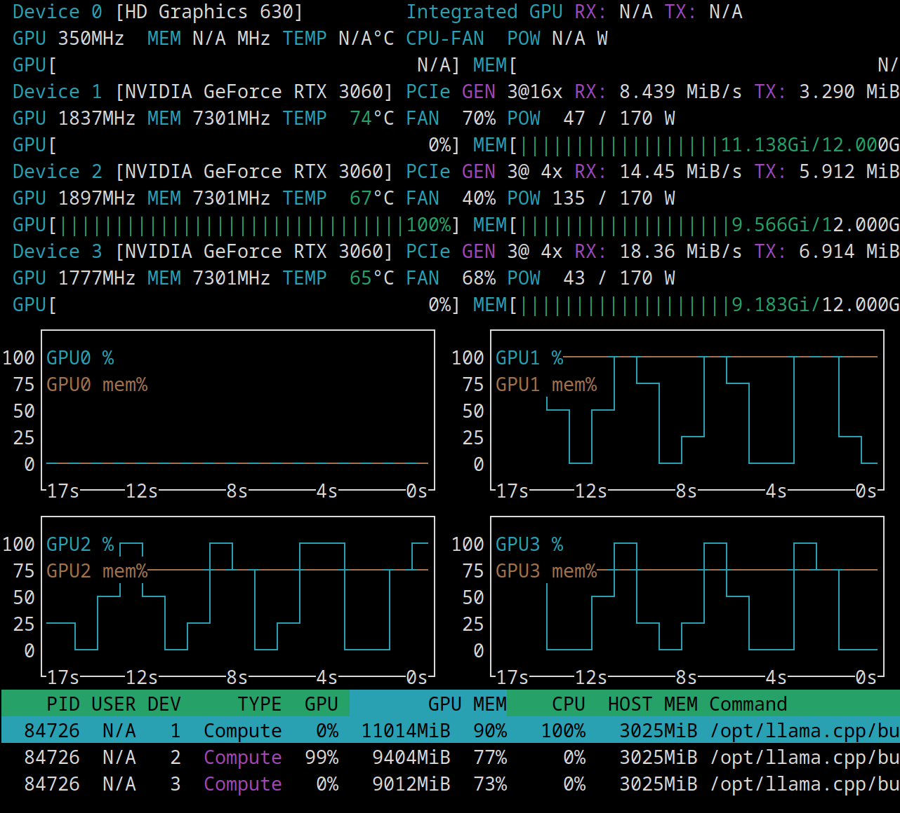
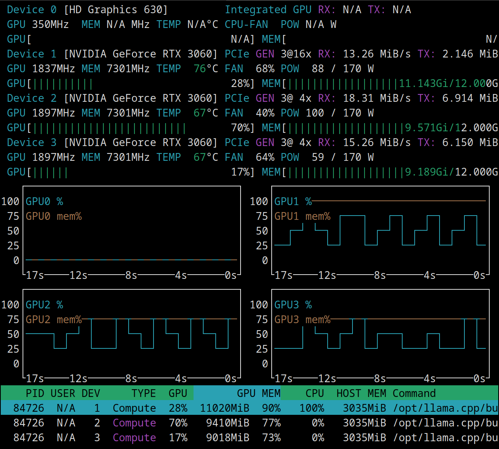

# Triple GPU Full Context Ladder — GLM-4.7-Flash

**Date:** 2026-03-03  
**Model:** GLM-4.7-Flash-UD-Q4_K_XL.gguf  
**Hardware:** 3x RTX 3060 (36GB VRAM total)  
**Runtime:** `--ctx-size 262144 --split-mode layer --ngl 99 --parallel 1 --reasoning-format deepseek`

---

## Visual Evidence: MLA Architecture Fingerprinting

GLM's Multi-head Latent Attention (MLA) shows **distinctive utilization patterns** that differ between processing phases:

### Prompt Processing (PP) — Extreme Zig-Zag Pattern



**Characteristics:**
- **Aggressive 0-100% alternating spikes** across all GPUs
- GPUs alternate in waves rather than parallel continuous load
- Memory-bandwidth bound, bursty parallel processing
- VRAM: ~30GB total (11.1GB + 9.6GB + 9.2GB)

### Text Generation (TG) — Gentler Wave Pattern



**Characteristics:**
- **More sustained 25-75% utilization** (less extreme swings)
- GPU1: 28%, GPU2: 70%, GPU3: 17% (less synchronized)
- Compute-bound sequential token generation
- Steadier load compared to PP phase

**Key insight:** MLA architecture shows **different GPU utilization signatures for PP vs TG**, suggesting sequential wave processing rather than parallel streaming.

---

## Complete Context Speed Ladder (0-250K)

**[Results pending - test completing now]**

| Context | PP tok/s | TG tok/s | TG % | Notes |
|--------:|---------:|---------:|-----:|-------|
| [Filling in as test completes] |

---

## Key Findings

### Prompt Processing (PP)
- **[Results pending]**

### Text Generation (TG)
- **[Results pending]**

### Performance Zones
- **[Results pending]**

---

## Architecture Characteristics: MLA (Multi-head Latent Attention)

Based on visual evidence from nvtop screenshots:

**PP Phase (Prompt):**
- Extreme alternating GPU spikes (0-100%)
- Memory-bandwidth limited
- Bursty parallel ingestion
- Suggests sequential layer processing with wave distribution

**TG Phase (Generation):**
- Gentler sustained waves (25-75%)
- Compute-bound
- Less synchronized across GPUs
- Sequential token-by-token generation pattern

**Compared to other architectures (3×3060):**

| Model | Architecture | PP Pattern | TG Pattern |
|-------|-------------|------------|------------|
| GLM-4.7 | MLA | **Extreme zig-zag** | Gentle waves |
| Nemotron-30B | Mamba-2 | [Screenshot pending] | [Screenshot pending] |
| Qwen3.5-35B | GQA | [Screenshot pending] | [Screenshot pending] |

---

## 3-GPU Distribution

**VRAM usage (from screenshots):**
- GPU1: 11.1 GB
- GPU2: 9.6 GB  
- GPU3: 9.2 GB
- **Total: ~30 GB**

**Utilization patterns:**
- PP: Alternating 0-100% spikes
- TG: Mixed 17-70% sustained loads

---

## Runtime Configuration

```bash
llama-server \
  --model /mnt/models/gguf/glm-4.7-flash/GLM-4.7-Flash-UD-Q4_K_XL.gguf \
  --ctx-size 262144 \
  --split-mode layer \
  --gpu-layers 99 \
  --parallel 1 \
  --flash-attn on \
  --reasoning-format deepseek \
  --cache-type-k q8_0 \
  --cache-type-v q4_0 \
  --host 0.0.0.0 \
  --port 8080
```

---

## Comparison to Nemotron & Qwen3.5

**[Results pending - full comparison table after test completes]**

---

## Test Methodology

- **Script:** `llmlab/scripts/run_context_ladder.py`
- **Test points:** 13 (9, 3K, 6K, 10K, 13K, 19K, 24K, 32K, 64K, 95K, 128K, 192K, 250K)
- **Per test:** Prompt eval + 3 tokens generation
- **Visual monitoring:** nvtop screenshots captured during PP and TG phases
- **Duration:** [Pending completion]

---

## Next Steps

1. Complete full numerical comparison vs Nemotron and Qwen3.5
2. Capture comparison screenshots for Nemotron and Qwen3.5 (PP + TG phases)
3. Update GLM model profile with 3×3060 results
4. Document MLA architectural advantages/disadvantages vs Mamba-2 and GQA

---

## Changelog

- **2026-03-03:** Initial experiment with visual GPU utilization fingerprinting (MLA architecture analysis)
