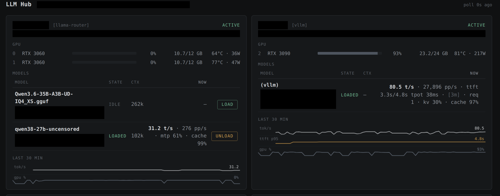
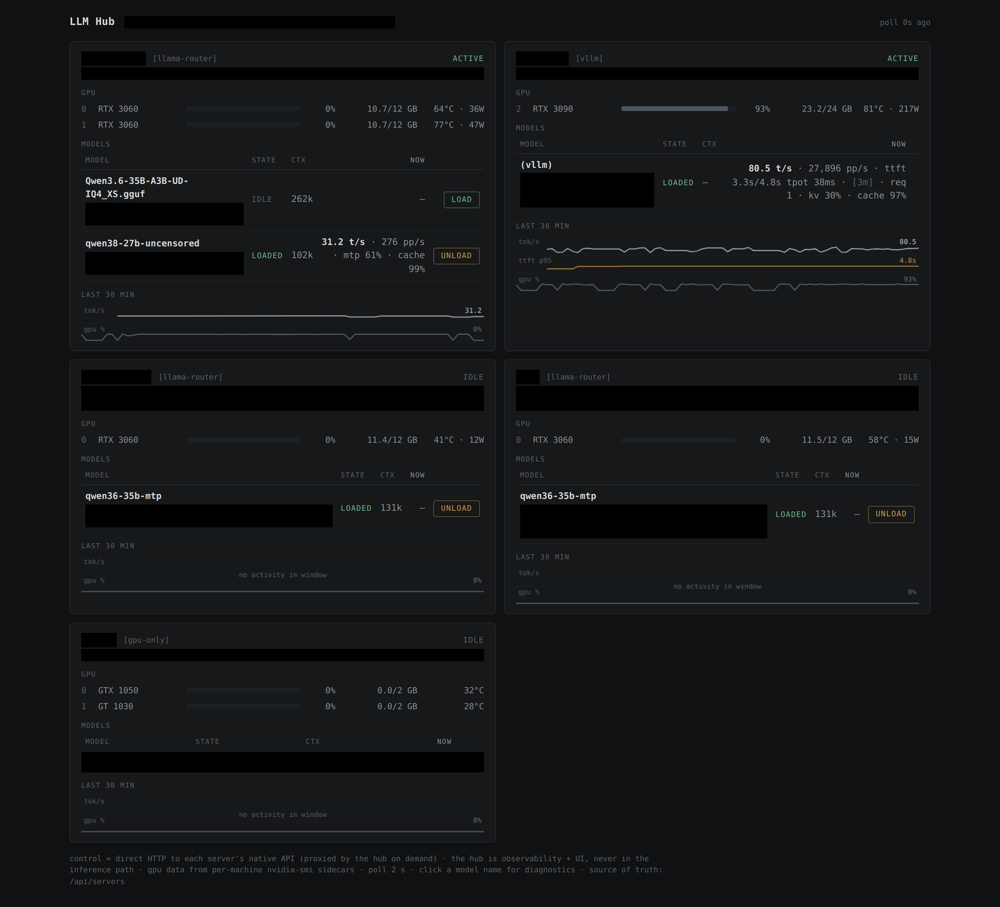
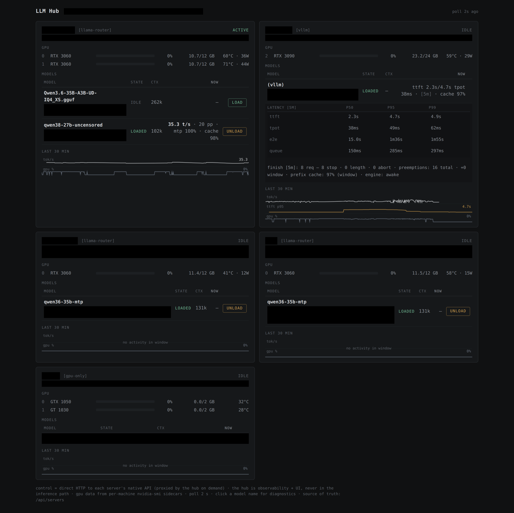
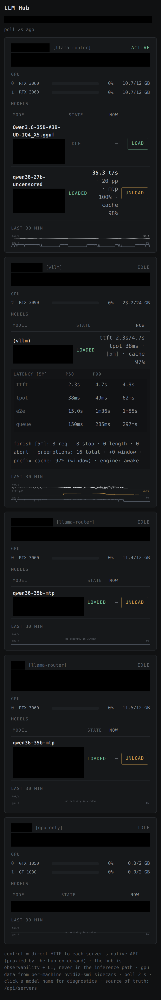

# LLM Hub — inference fleet monitoring & control

A single-file, stdlib-only Python service for monitoring and controlling a
mixed llama.cpp / vLLM inference fleet. It provides a web UI, a JSON API for
agents, and a Prometheus-compatible `/metrics` endpoint.

## Architecture

```text
              browser / agents
                    |
                    v
  +--------------------------------+
  |             LLM Hub            |   web UI + JSON API + /metrics
  +------+----------+----------+---+
         |          |          |
         v          v          v
   llama.cpp      vLLM     gpu-sidecars
   router(s)      server   (nvidia-smi -> JSON, one per GPU host)

   inference clients talk directly to the llama.cpp / vLLM servers —
   the hub is not in the request path
```

The hub is outside the inference request path. Clients talk directly to the
inference servers; if the hub goes down, inference continues and only
monitoring and control are unavailable. Model load/unload commands are
proxied through the hub on demand — the same native router API a client
could call directly.



## Quick start

```sh
mkdir -p hubrun && cd hubrun
cp ../config.example.json config.json && $EDITOR config.json   # your servers + port
head -c 32 /dev/urandom | od -An -tx1 | tr -d " \n" > token && chmod 600 token
python3 ../llm-hub.py
# or with the env overrides:  LLM_HUB_CONFIG=… LLM_HUB_TOKEN=… LLM_HUB_UI=… LLM_HUB_STATE=…
```

Then open `http://localhost:8443/` and paste the token into the unlock form.
For GPU telemetry, run `gpu-sidecar.py` on each GPU host first.
For the systemd layout, see [Deploy](#deploy).

## What it shows

Per server, every 2 s:

- **llama.cpp routers**: generation throughput (t/s) and
  prompt-processing throughput (pp/s), speculative-decoding (MTP)
  acceptance, prompt-cache hit rate (5-min window), in-flight and deferred
  requests, busy decode slots, and model load state.
- **vLLM**: generation and prompt-processing throughput, rolling p50/p95/p99
  percentiles for TTFT, TPOT, E2E and queue time, queue and KV-cache state,
  prefix-cache hit rate, preemptions, engine state, and finish reasons.
- **GPU telemetry**: per-card utilization, VRAM, temperature, and power,
  from the per-host sidecar.

Model rows are collapsible: the collapsed line carries the rate and the key
load signals; expanding shows the full diagnostics block. Node state is
summarized as `offline`, `idle`, `active`, `busy`, or `degraded`; detailed
diagnostics remain collapsed until needed.

### State derivation

States are derived per model (node state is the worst across its models):

- `offline` — no answer for ~30 s (15 consecutive 2 s polls); model rows
  show last-known state flagged `stale`.
- `idle` — not loaded, stale, or no activity (the common state).
- `active` — requests in flight or recent generation.
- `busy` — requests waiting, deferred requests, or KV cache ≥ 75 %.
- `degraded` — KV cache ≥ 90 %, responses hitting the length limit, or
  preemptions while KV ≥ 80 %.

### Metric semantics

- **Throughput rates** (generation and prompt-processing) come from counter
  deltas. On llama.cpp the generation rate is measured against the child
  process's own generation clock (`Δtokens_predicted /
  Δtokens_predicted_seconds`), so it is physically bounded and immune to
  poll-gap artifacts; vLLM counters are process-lifetime cumulative, so
  wall-clock deltas are used.
- Rates decay to "no data" 30 s after the counter **last moved** — idle is
  shown as no value, not as a stale number. This applies to every rate,
  including vLLM prompt throughput.
- A counter **decrease** (child restart / model reload) re-baselines
  instead of producing a spike.
- **vLLM percentiles** are interpolated from the engine's native histogram
  buckets over a rolling window (default 300 s) — bucket deltas, not
  process-lifetime cumulative values. Resolution is bounded by the engine's
  bucket edges. llama.cpp has no equivalent latency histograms; that is a
  vLLM-only capability.
- Unknown values are `null` in the API and **omitted** in `/metrics` (not
  `NaN`, which would poison PromQL aggregates; not `0`, which must mean
  "measured, zero").

## API

| Endpoint | Auth | Purpose |
|----------|------|---------|
| `GET /api/servers` | token/cookie | full fleet JSON (UI + agents) |
| `GET /api/models` | token/cookie | flat model list with server attribution (agents) |
| `GET /api/vision/route` | token/cookie | advisor: best vision endpoint for an upcoming multimodal request (read-only) |
| `POST /api/models/load` | token/cookie | `{server, model}` → proxies to router |
| `POST /api/models/unload` | token/cookie | same, unload |
| `POST /auth` | Bearer master token | exchange token for 7-day session cookie |
| `GET /auth` | token/cookie | convenience: is my session valid? |
| `GET /metrics` | public | Prometheus exposition format (topology-level data) |
| `GET /health` | public | liveness + poller freshness |

The JSON API is the agent interface: one call returns every server, its
models, GPU state and the rolling metrics, so an orchestrating agent can
decide "which node is free for a 100K-context job" without scraping each
backend. Example:

```console
$ curl -H "Authorization: Bearer $TOKEN" http://hub:8443/api/models
{
  "ts": 1788710630.6,
  "models": [
    {"id": "some-35b.gguf", "loaded": false, "tgen": null, "tpp": null,
     "spec_accept": null, "ctx": 262144, "stale": false, "cache_hit": null,
     "n_proc": null, "n_deferred": null, "busy_slots": null,
     "server": "router-a", "server_online": true},
    {"id": "some-27b", "loaded": true, "tgen": 29.7, "tpp": 102.4,
     "spec_accept": 0.57, "ctx": 102400, "stale": false,
     "n_proc": 1, "n_deferred": 0, "busy_slots": 1,
     "server": "router-a", "server_online": true}
  ]
}
```

(Fields trimmed for readability; vLLM entries additionally carry
`latency`, `finish`, `kv_used`, `preempt_*`, `sleep`.)

### Vision advisor (`GET /api/vision/route`)

A **read-only advisor** for consumers about to send an OpenAI-compatible
multimodal (image) request: it answers from the hub's asynchronously polled
state (typical response well under a second) which node to send it to, and
**nothing more** — it never loads/unloads models, never proxies the request,
and never sees the image or prompt payload. The consumer sends the request
directly to `choice.url` (e.g. `POST {url}/v1/chat/completions`) and keeps a
static emergency fallback of its own for when the hub is unreachable.

The motivation is the failure mode of a static primary/fallback pair on a
`--models-max 1` router: the preferred model can be evicted, and the fallback
on the same node can be pinned by a single long-context request — so "the
configured vision node" can be unavailable for days while every probe still
times out. The design report with the measurements, the two-class capacity
model and the rejected alternatives: [reports/2026-09-07-llm-hub-adaptive-vision-routing.md](../reports/2026-09-07-llm-hub-adaptive-vision-routing.md).

Query parameters (all optional): `images`, `max_width`, `max_height` — accepted
in the contract; Phase 1 scoring is request-shape-independent.

```console
$ curl -H "Authorization: Bearer $TOKEN" "http://hub:8443/api/vision/route?images=1"
{
  "ok": true,
  "policy_version": 1,
  "choice": {
    "server": "router-a", "model": "some-35b.gguf", "url": "http://<gpu-server>:8081",
    "api": "openai-chat", "kind": "llama.cpp", "capacity": "immediate",
    "score": 0.9, "state_age_ms": 2100
  },
  "reason": "lowest configured vision tier among eligible candidates; execution capacity free",
  "reason_codes": ["loaded", "image_capable", "immediate_capacity", "preferred_tier"],
  "alternates": [
    {"server": "router-b", "model": "some-35b", "url": "http://<gpu-server-2>:8080",
     "api": "openai-chat", "kind": "llama.cpp", "capacity": "queued", "score": 0.8,
     "state_age_ms": 2100}
  ],
  "rejected": [
    {"name": "router-a/some-27b", "code": "not_loaded",
     "detail": "model not currently resident in the backend"}
  ]
}
```

Semantics:

- **Hard filters first** (in order): server online → state fresh (not older
  than `vision.stale_after_s`) → model loaded → image-capable → not disabled
  in the policy. Each rejection is reported with its code in `rejected`.
- **Two capacity classes**: any **IMMEDIATE** candidate (a request would not
  join a queue) outranks any **QUEUED** one (all slots busy / requests
  deferred). This ordering exists because a queued single-slot model is the
  outage mode, not a slow-but-working one.
- **Within a class**: configured tier (lower = preferred; encode measured
  vision speed, not host identity), then GPU contention, then in-flight load.
- **Honest degradation**: if only queued candidates exist, the best one is
  returned with `reason_codes: [..., "queued", "only_queued_available"]` so
  the consumer can warn the user about expected wait; if none exist, `ok:
  false` with the reject codes. `state_age_ms` tells the consumer how fresh
  the decision is.
- **Vision capability** comes from the backend's `/v1/models`
  `architecture.input_modalities` (llama.cpp). Absent metadata: a llama.cpp
  model is treated as capable (older builds under-reported — see
  [the 27B card](../models/legacy/qwen3.8-27b-uncensored-dual3060.md)), while a vLLM
  model is treated as *not* capable (its `/v1/models` exposes no modalities
  at all) until opted in via `vision: {"image_capable": true}`. A per-model
  `vision: {"image_capable": false}` excludes a model that reports image
  input, and `vision: {"enabled": false}` removes it from routing entirely.
- **Security note**: the endpoint is token-protected (like the other control
  plane), returns only server names, model ids, URLs and metrics — never
  request payloads — and the hub stays outside the inference data path, so a
  hub outage degrades routing to the consumer's static fallback instead of
  breaking inference.

Exposed to Prometheus as `hub_vision_route_available`,
`hub_vision_candidate_eligible`, `hub_vision_candidate_reject_code`,
`hub_vision_candidate_selected`, `hub_vision_choice_score`,
`hub_vision_state_age_seconds` and `hub_vision_routes_total` (the last
incremented per advisor call, per chosen endpoint).

### Auth model

- **Agents/CLI**: master Bearer token (one file, `chmod 600`).
- **Browser**: exchanges the master token once via `POST /auth` for an
  HMAC-signed `HttpOnly` session cookie (7 days). The UI shell is
  public; data requires auth. The page itself never contains the token.
- **Missing token fails boot.** The token file is required unless
  `LLM_HUB_ALLOW_NO_AUTH=1` is set — an unauthenticated hub is a deliberate
  dev choice, not an accident, and warns loudly on startup. `/metrics` and
  `/health` stay public either way (see below).

## Security

- **Treat the hub token as an administrative credential.** Authenticated
  callers can trigger model load/unload on configured nodes (proxied to the
  router's native API and appended to `audit.log`). Run the hub on a
  trusted network or behind your existing access-control layer; it is not
  designed for direct Internet exposure.
- The session cookie is HMAC-signed with the master token: anyone who
  obtains the token file can mint valid cookies. Rotate by replacing the
  token file and restarting. The cookie is `HttpOnly; SameSite=Lax`; set
  `LLM_HUB_COOKIE_SECURE=1` when the hub sits behind an HTTPS reverse proxy
  (off by default so plain-HTTP local testing works).
- No separate CSRF token is used. The browser session cookie is
  `SameSite=Lax`, which prevents it from being sent with ordinary cross-site
  POST requests. The hub is still intended for trusted-network deployment
  rather than direct Internet exposure.
- `/metrics` and `/health` are public by design — topology-level data
  (names, rates, GPU counters), no prompts or payloads. If that's too much
  for your network, put the hub behind an auth proxy.

## Config

`/etc/llm-hub/config.json` (see `config.example.json`):

```json
{
  "port": 8443,
  "servers": [
    {"name": "…", "kind": "llama-router", "url": "http://host:8081",
     "sidecar": "http://host:9421", "description": "…"},
    {"name": "…", "kind": "vllm", "url": "http://host:8080",
     "sidecar": "http://host:9421", "description": "…"},
    {"name": "…", "kind": "gpu-only", "sidecar": "http://host:9421",
     "description": "GPU telemetry only"}
  ]
}
```

`kind` is `"llama-router"` (a llama.cpp server exposing the OpenAI-style
`/v1/models` catalog + per-model `/metrics?model=`), `"vllm"`, or
`"gpu-only"` (no inference API; online state comes from the sidecar).
`sidecar` is the per-host `gpu-sidecar` URL (default assumption: same host
as the server). A `gpu_sidecars` list of `{server, url}` entries may also be
used; it overrides the per-server keys.

Validation at boot (all errors listed, exit 1): every entry needs a
unique `name` (names are API selectors and metric labels), `kind` must be
one of the three values above, non-gpu-only entries need a `url`, and
each `gpu_sidecars` entry needs a `url` and a `server` that exists in
`servers`.

Per-model hints are supported via a `models` object on a server entry:

```json
{"name": "…", "kind": "llama-router", "url": "…",
 "models": {"some-model": {"ctx": 262144, "desc": "notes"}}}
```

`ctx` is otherwise taken from the router's `--ctx-size` launch args when
available.

### Environment overrides (testing)

| Var | Default |
|-----|---------|
| `LLM_HUB_CONFIG` | `/etc/llm-hub/config.json` |
| `LLM_HUB_TOKEN` | `/etc/llm-hub/token` |
| `LLM_HUB_STATE` | `/var/lib/llm-hub` |
| `LLM_HUB_UI` | `/opt/llm-hub/ui` |
| `LLM_HUB_LAT_WINDOW` | `300` (percentile window seconds) |
| `LLM_HUB_COOKIE_SECURE` | off (`1`/`true` adds `Secure` to the session cookie) |
| `LLM_HUB_ALLOW_NO_AUTH` | off (`1`/`true` boots without a token file; default fails boot) |

## Deploy

```sh
# hub host
mkdir -p /opt/llm-hub/ui /etc/llm-hub /var/lib/llm-hub
install llm-hub.py /opt/llm-hub/
install ui/index.html /opt/llm-hub/ui/
install config.json /etc/llm-hub/
install -m 600 token /etc/llm-hub/token
systemctl enable --now llm-hub

# each GPU host
install gpu-sidecar.py /opt/llm-hub/
systemctl enable --now gpu-sidecar
```

The hub is unprivileged; put TLS in front (reverse proxy) if you expose it.

## Prometheus export

`/metrics` emits `hub_*` gauges: server online state, per-GPU
utilization/memory/temperature/power, per-model generation and
prompt-processing throughput, backend parser-compat flags
(`hub_vllm_metrics_ok`, `hub_llama_metrics_ok`), vLLM latency percentiles
(seconds), request counts, KV usage, cache hit rates, preemptions, and
engine sleep state.
Unknown values are omitted rather than exported as `NaN` (which would poison
`avg()`/`sum()` in PromQL); a measured zero is exported as `0`.
This is the stable scrape surface for a Grafana stack — a separate concern;
the hub does not require Prometheus.

## State

In-memory: a 30-minute sparkline ring and 5-minute rolling windows per
server, plus a periodic `snapshot.json` in the state dir (restored on boot
so the UI isn't blank after a hub restart). No historical storage — for
long-term trends, scrape `/metrics`.

## Compatibility

Currently tested with:

- llama.cpp server builds tested in September 2026 (per-model
  `/metrics?model=`, OpenAI-style `/v1/models` catalog)
- vLLM 0.27.x
- NVIDIA GPUs via `nvidia-smi` (any architecture; older "Pascal"-era
  cards that report power as `[N/A]` are tolerated)

Metric names do change upstream, so newer backend versions may require
parser updates. The `*_metrics_ok` gauges exist exactly for that: they are
`1` when the backend is reachable **and** the core counters the hub's rate
math depends on were found, `0` when the backend answered but the parser
reads nothing (a counter-name mismatch), and omitted for unloaded models
(the backend endpoint simply wasn't queried):

- `hub_vllm_metrics_ok` — `generation_tokens_total` present
- `hub_llama_metrics_ok` — `tokens_predicted_total` and
  `prompt_tokens_total` present

An idle backend still reads `1`; a measured zero is a `0` on the
throughput gauges, never on these.

## Known limitations

- **History is in-memory and short-lived**: 30-min sparklines and 5-min
  rolling windows; a hub restart loses history except the last snapshot.
  No long-term storage — scrape `/metrics` for trends.
- **No alerting** — state is shown, not notified.
- vLLM latency percentiles need at least one observation inside the rolling
  window; with no recent requests they show `—` (no stale values).
- vLLM is treated as one logical model per server; multi-model vLLM
  deployments are not distinguished.
- llama.cpp has no latency histograms, so TTFT/TPOT percentiles are a
  vLLM-only feature.
- The UI is a single page with a full 2 s refresh — built for a few dozen
  nodes, not hundreds.
- Polling is a single shared loop: a stalled backend (4 s fetch timeout)
  delays the other servers by up to one fetch per configured model per
  cycle.
- No TLS of its own; `/metrics` and `/health` are unauthenticated
  (topology-level data only).
- It is a monitoring/control layer for your own fleet, not a
  Prometheus/Grafana replacement.

## Screenshots



<details>
<summary>Diagnostics view (expanded model row)</summary>



</details>

<details>
<summary>Mobile layout</summary>



</details>

Server names and descriptions in the screenshots are redacted.

## Files

| File | Purpose |
|------|---------|
| `llm-hub.py` | the hub (poller + HTTP API + vision advisor + Prometheus export + UI server) |
| `vision_routing.py` | the vision-routing policy (pure module: eligibility, capacity classes, ordering) |
| `test_vision_routing.py` | unit tests for the vision policy (stdlib `unittest`, no network) |
| `gpu-sidecar.py` | per-GPU-host `nvidia-smi` → JSON sidecar (the hub polls it) |
| `ui/index.html` | the web UI (single file, no build step, no framework) |
| `config.example.json` | config template |
| `llm-hub.service` | systemd unit for the hub |
| `gpu-sidecar.service` | systemd unit for the sidecar |
| `screenshots/` | UI screenshots (redacted) |

No dependencies beyond CPython stdlib. No Docker, no JS framework, no
database. One process per role.
